# Final Review Presentation
## Learning to Manipulate from Minimal Supervision
### Rhys Newbury

---

# Overview

This thesis explores methods for enabling robots to **learn and adapt their behaviour** in settings with **limited prior knowledge or supervision**, focusing on **manipulation tasks**.

The overarching goal is to develop **learning frameworks** that enable **efficient skill transfer** across **tasks** and **robot embodiments**, and for this we focus on three research areas

---

# Research Focus

During this thesis, we tackle three core challenges:

-  **Unknown Embodiments** — generalizing across unknown robot morphologies 
-  **Trajectory Imitation** — transferring across embodiments from <em>a single demo</em>  
-  **Grasp Imitation** — Learning grasping skills for a class of objects from <em>a single demo</em>.

All share a common theme:  
→ **Learning from limited data** while maintaining **broad generalization** across embodiments.

---

#  Single-Demo Grasp Learning

- Humans can generalize a grasp across different object instances easily:  
  e.g., always grasp a mug by the handle, regardless of shape variation.  
- Robots struggle with this: transferring a grasp from one object to another often needs retraining or large dataset.  
- We aim to **enable grasp transfer** between novel objects using **only one demonstration**.

--- 
# Key Idea: Use 3D Keypoints as Semantic Anchors

- The final part of a grasp can be described by **where** contact happens.  
- If we can learn **consistent 3D keypoints** across shapes, then we can generalize a grasp demonstration to new objects from the same class.  
- These keypoints can serve as **semantic anchors** guiding grasp generation.

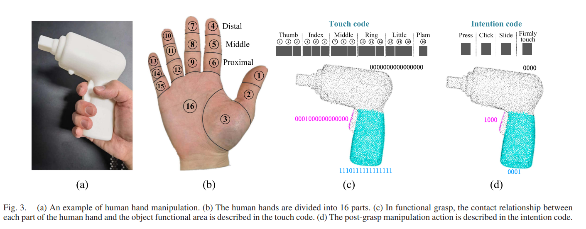

T. Zhu, R. Wu, J. Hang, X. Lin and Y. Sun, "Toward Human-Like Grasp: Functional Grasp by Dexterous Robotic Hand Via Object-Hand Semantic Representation," in IEEE Transactions on Pattern Analysis and Machine Intelligence

---

# High-Level Grasping Pipeline

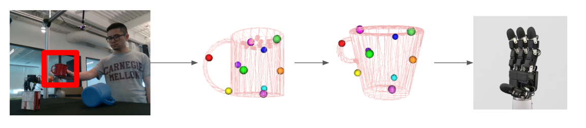

**Pipeline Overview**
1. **Input:** Single grasp demonstration on canonical object  
2. **Learned Keypoints:** Extract consistent 3D keypoints across shapes  
3. **Optimization:** Align robot fingertips to keypoints via differentiable simulation  

---

# Why Keypoints?

- Represent complex shapes in a **low-dimensional, interpretable** form  
- Can easily increase amount of keypoints for finer resolution.
- Enable **semantic transfer**
- Learnable **without supervision** from 3D data

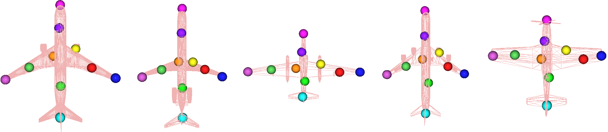

Example of discovered repeatable keypoints for a Plane object.

---

# How do we find keypoints?

---

# Background

- 3D reconstruction methods typically compress geometric information into **latent vectors**.  
- Such embeddings, while effective, often lack **interpretability** — they don’t correspond to human-understandable object parts.  
- Structured representations (like **keypoints** or **skeletons**) provide a bridge: low-dimensional, intuitive, and semantically meaningful.  

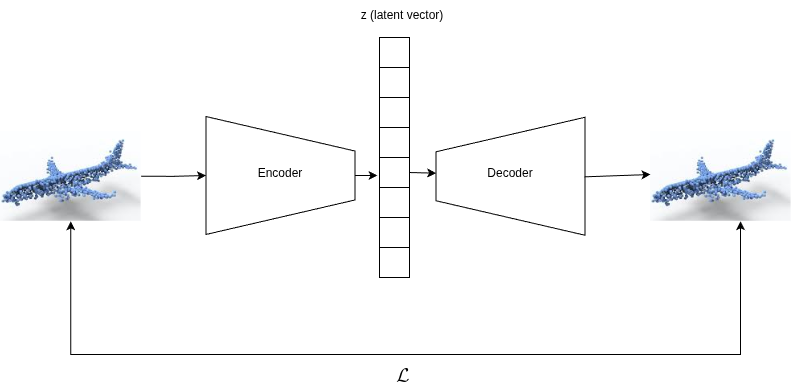

---

# How do others find Keypoints?

- KeypointDeformer (Jakab et al., 2021) is a cage-based model that learns semantically consistent 3D keypoints via a differentiable mesh deformation
- Key-Grid  (Hou et al., 2024) introduces a grid-based heatmap decoder in an autoencoder framework to encourage semantically consistent keypoints across objects.
- Skeleton Merger (SM) (Shi et al., 2021) builds a skeletal graph by predicting keypoints as nodes and their connections as edges, and uses this skeleton to reconstruct the 3D object
- SC3K (Zohaib & Del Bue, 2023) enforces cycle-consistency by comparing keypoints from multiple randomly rotated views of the same object, ensuring the keypoints remain semantically stable for each object instance

Hou, C., Xue, Z., Zhou, B., Ke, J., Shao, L., & Xu, H. (2024). Key-Grid: Unsupervised 3D keypoints detection using grid heatmap features. In Proceedings of the 38th Conference on Neural Information Processing Systems (NeurIPS 2024)
Jakab, T., Tucker, R., Makadia, A., Wu, J., Snavely, N., & Kanazawa, A. (2021). KeypointDeformer: Unsupervised 3D keypoint discovery for shape control. In Proceedings of the IEEE/CVF Conference on Computer Vision and Pattern Recognition (CVPR 2021)
Shi, R., Xue, Z., You, Y., & Lu, C. (2021). Skeleton Merger: An unsupervised aligned keypoint detector. In Proceedings of the IEEE/CVF Conference on Computer Vision and Pattern Recognition (CVPR 2021)
Zohaib, M., & Del Bue, A. (2023). SC3K: Self-supervised and coherent 3D keypoints estimation from rotated, noisy, and decimated point cloud data. In Proceedings of the IEEE/CVF International Conference on Computer Vision (ICCV 2023)

---

# Background: Diffusion Models

- Diffusion models are generative frameworks that learn to reverse a gradual noising process, transforming pure noise into structured data through step-wise denoising.
- In the forward process, noise is incrementally added to data until it becomes random; the reverse process learns to remove this noise to recover the original structure.
- Karras et al. (2022) introduced the Elucidated Diffusion Models (EDM) approach, simplifying diffusion model design via optimized noise schedules and network conditioning, achieving state-of-the-art image generation quality with significantly faster sampling
- DPM (Luo & Hu, 2021) adapts this idea to point clouds by modeling 3D points as particles in a heat bath and conditioning the reverse process on a shape latent to generate diverse 3D shapes.

Karras, T., Aittala, M., Aila, T., & Laine, S. (2022). Elucidating the design space of diffusion-based generative models. Advances in Neural Information Processing Systems, 36 (NeurIPS 2022).
Luo, D., & Hu, R. (2021). Diffusion probabilistic models for 3D point cloud generation. In Proceedings of the IEEE/CVF Conference on Computer Vision and Pattern Recognition (CVPR) (pp. 2837–2845). 

---

# Network Overview

We learn 3D keypoints end-to-end from point clouds using an **autoencoder** network through, using **diffusion-based** reconstruction as an auxilary task.

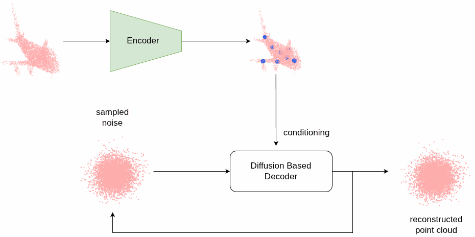

---

# Convex Keypoint Encoder

- Transformer-based encoder predicts attention weights for each input point
- Compute keypoints as **attention weighted combinations** of input points
- Guarantees keypoints lie inside the convex hull of the object.

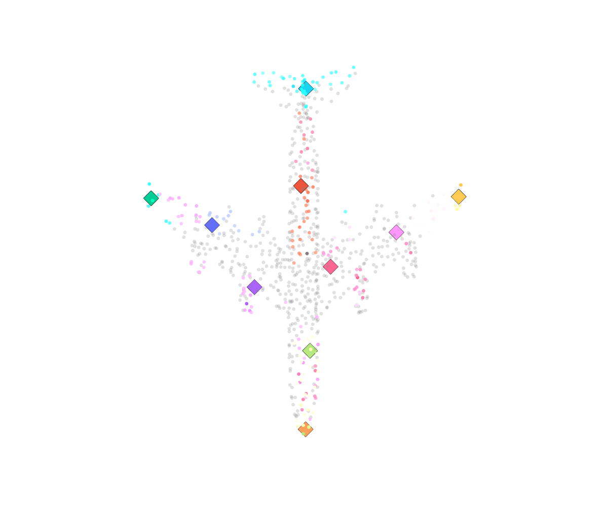

<!-- <iframe
  src="airplane_attn_interactive.html"
  width="100%"
  height="500px"
  style="border:none; display:block; margin:auto;"
></iframe> -->

---

# Decoder (Diffusion-Based)

- Point-wise denoising network conditioned on the latent vector
- Uses:
  1. Sinusoidal timestep embedding  
  2. Shape context vector from encoder  
- Cross-attention layers to allow noisy points to align with global shape context  
- FiLM-conditioned (Pérez et al., 2018) MLP layers adaptively denoise points

Pérez, E., Strub, F., de Vries, H., Dumoulin, V., & Courville, A. C. (2018). FiLM: Visual reasoning with a general conditioning layer. Proceedings of the AAAI Conference on Artificial Intelligence, 32(1).

---

# Training Objectives

| Term | Purpose |
|------|----------|
| $L_{diff}$ | Chamfer distance between ground truth and denoised input |
| $L_{chamfer}$ | Keypoint proximity to shape |
| $L_{KL}$ | Regularize auxiliary latent |
| $L_{FPS}$ | Ensure keypoint coverage by aligning against furthest point sampling |
| $L_{mse}$  | Deformation consistency |

Together they align the latent space with an **ELBO**-like objective, ensuring both fidelity and interpretability.

---

# $L_{mse}$

### Deformation Consistency Loss

- This term enforces consistency between predicted keypoints before and after a series of deformations applied to the input.
- This should encourage stable keypoints between inputs.

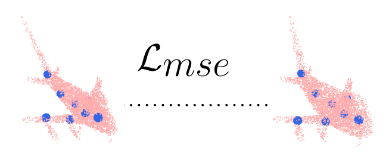

---

# Results

We evaluate our model on **ShapeNet** categories, comparing against keypoint-based and diffusion baselines (KPD, KeyGrid, SC3K, Skeleton Merger, and DPM).  
Performance is measured via, two keypoint metrics:

- **Dual Alignment Score (DAS)** — Does it align with human *semantic keypoint labels*?
- **Keypoint Correspondence** — Does it align with human *semantic segmentation labels*

and two reconstruction based metrics:

- **Chamfer Distance (CD)** and **Earth Mover’s Distance (EMD)** — reconstruction quality  
- **Minimum Matching Distance (MMD)-CD** — generative quality.

--- 

## Aside: Baselines do not match results

- Baseline results reported in prior works are not directly reproducible when using their open-source implementations.
- We observe inconsistencies between the original papers and reconstructed runs.
- This often stems from missing implementation details.
- One contribution of this work is a training framework that standardizes these implementations, ensuring consistent reproduction and comparison across baselines.
---

# Quantitative Evaluation

| Metric | KPD | KeyGrid | KeyGridOrig | SC3K | SM | **Ours** |
|---------|-----|----------|--------------|------|----|-----------|
| **DAS (↑)** | 0.69 ± 0.13 | 0.63 ± 0.10 | 0.67 ± 0.12 | 0.62 ± 0.033 | 0.72 ± 0.13 | **0.79 ± 0.077** |
| **Correspondence (↑)** | 0.69 ± 0.16 | 0.93 ± 0.038 | 0.92 ± 0.047 | 0.90 ± 0.04 | 0.91 ± 0.031 | **0.98 ± 0.019** |

- Our model achieves SOTA results on both DAS and Correspondence

---
# Latent Space Interpolation

We explore how **interpolation in latent space** correspond to **continuous changes in generated shapes**.

- Samples are linearly interpolated between two latent codes (i.e., two sets of keypoints):  
- Intermediate reconstructions demonstrate that the model captures **semantically meaningful** and **geometrically consistent** variations.

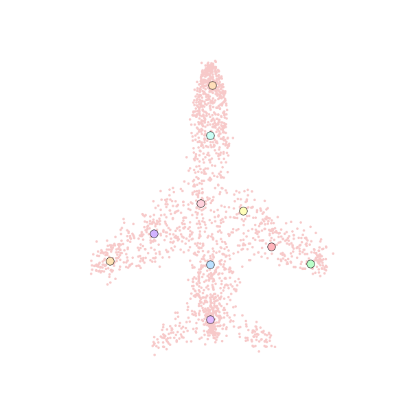

---

# Grasp Transfer via Keypoint Correspondence and Differentiable Simulation

-  Extract 3D keypoints on both canonical and target objects
-  Transfer keypoints from the canonical object to the target instance via the keypoint space.
-  Jointly optimize the robot’s hand configuration and grasp stability through differentiable physics simulation, aligning fingertips with the transferred keypoints.

---

## Background: Grasping via Differentiable Simulation

- Differentiable simulation approach: Fast-Grasp’D (Turpin et al., 2023) makes the grasping simulation (incl. contact physics) differentiable, enabling gradient-based optimization of multi-finger grasps
- Uses gradient descent on a grasp stability objective within the differentiable simulator to synthesize contact-rich grasps, optimize finger joint angles until a high-quality grasp is found.

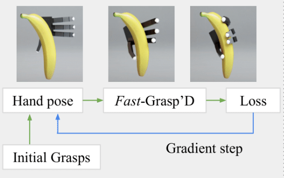

D. Turpin et al., "Fast-Grasp'D: Dexterous Multi-finger Grasp Generation Through Differentiable Simulation," 2023 IEEE International Conference on Robotics and Automation (ICRA), London, United Kingdom, 2023, pp. 8082-8089, doi: 10.1109/ICRA48891.2023.10160314.

---

## What is done.

- Can transfer grasp using keypoints from human to robot on *same object instance*
- We use the differentiable simulation engine Warp

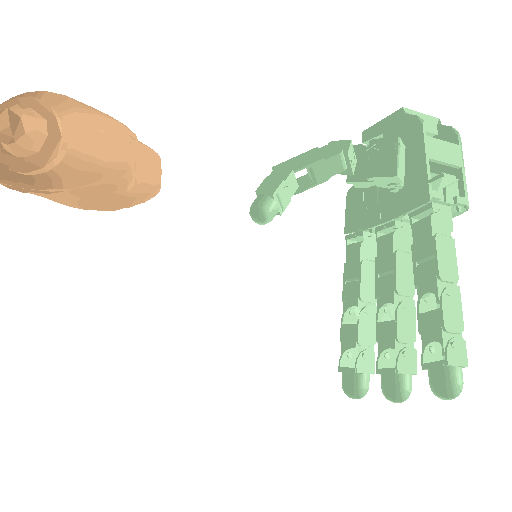

---
## What is left.

- Combine with the keypoint discovery to enable grasp transfer across object instances within a class.
- Conduct systematic simulation studies across YCB categories.
- Collect quantitative metrics for consistency and success rate.
- Implement the approach on a real robotic hand once simulation validation is complete

--- 

## Paper Submission Plan

All works I am **first author** and have contributed **more than 50%**. 

These works will make up a majority of my thesis. 

- **Newbury, R.**, Gu, M., Chumbley, L., Mousavian, A., Eppner, C., Leitner, J., Bohg, J., Morales, A., Asfour, T., Kragic, D., Fox, D., & Cosgun, A. (2023). Deep learning approaches to grasp synthesis: A review. IEEE Transactions on Robotics
- **Newbury, R.**, Schwartz, J., Kurniawati, H., & Kuli´c, D. (2025). Reinforcement learning for parameter-uncertain robotic manipulators. In Proceedings of the Australasian Conference on Robotics and Automation (ACRA). Australasian Robotics and Automation Association.
- **Newbury, R.**, Kurniawati, H., & Kuli´c, D. (2025). Transferring policies across different kinematic and dynamic configurations via state-matching. Manuscript submitted for publication. IEEE Robotics and Automation Letters (RAL).
- **Newbury, R.**, Zhang, J., Tran, T., Kurniawati, H., & Kuli´c, D. (2025). KeyPointDiffuser: Unsupervised 3D keypoint learning via latent diffusion models. Manuscript to be submitted for publication. IEEE/CVF Conference on Computer Vision and Pattern Recognition (CVPR) 2026.
- **Newbury, R.**, Zhang, J., Tran, T., Kurniawati, H., & Kuli´c, D. (2025). Grasp transfer via keypoint correspondence and differentiable simulation. Manuscript in preparation.

<!-- I have also contributed to these works during my thesis, however, they will not be included:

- Schwartz, J., **Newbury, R**., Kulić, D., & Kurniawati, H. (2025). POSGGym: A library for decision-theoretic planning and learning in partially observable, multi-agent environments. Autonomous Agents and Multi-Agent Systems, 39(2), 35. Springer US.
- Ferenczi, B., **Newbury, R**., Burke, M., & Drummond, T. (2024). Carefully structured compression: Efficiently managing StarCraft II data. arXiv preprint arXiv:2410.08659.
- Gupta, M., Bhowmick, D., **Newbury, R**., Saberi, M., Pan, S., & Beck, B. (2025). INSPIRE-GNN: Intelligent sensor placement to improve sparse bicycling network prediction via reinforcement learning boosted graph neural networks. arXiv preprint arXiv:2508.00141.
- Zhang, J., **Newbury, R**., Zhang, X., Tran, T., Kulić, D., & Burke, M. (2025). Why heuristic weighting works: A theoretical analysis of denoising score matching. arXiv preprint arXiv:2508.01597. -->

---

# Timeline

- Thesis submission on track for Mid March
- Major work left is to finish up experiments on grasping 

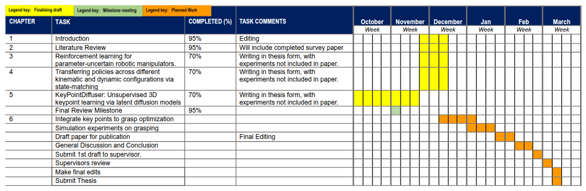

--- 
# Thank you for listening!

## Questions?

### **Thesis Contributions**
- Cross-embodiment **policy transfer** without explicit kinematic knowledge  
- **Single-demonstration** imitation and transfer framework across embodiments  
- **Unsupervised keypoint learning** for 3D object understanding  
- **Single-demonstration grasp transfer** via keypoint correspondence and differentiable simulation  

### **Ongoing Work**
- Integration of keypoint discovery with grasp transfer  
- Simulation studies on YCB categories  
- Real-world robotic validation  

---

# Appendix — $L_{diff}$  
### Denoising Reconstruction Loss  

$$
L_{\text{diff}}
= \alpha \, d(\hat{S}_0 \rightarrow S_0)
+ \beta \, d(S_0 \rightarrow \hat{S}_0)
$$

where each one-way Chamfer term is:

$$
d(A \rightarrow B) =
\frac{1}{|A|}\sum_{a \in A}
\min_{b \in B}\|a - b\|_2^2
$$

and in our implementation:  
$$
\alpha = 0.5, \quad \beta = 1.5
$$

- $S_0$: ground-truth (clean) point cloud  
- $\hat{S}_0 = f_\theta(S_t, t, z)$: denoised reconstruction  

### Intuition

- Penalizes **missing regions** more heavily than **extra points**.  
- Emphasizes reconstruction **coverage** of the true surface.  
- Produces smoother training dynamics and better geometric fidelity in diffusion decoding.

---

# Appendix — $L_{chamfer}$  
### Keypoint–Shape Proximity  

$$
L_{\text{chamfer}} =
\frac{1}{|K|}\sum_{k \in K}\min_{x \in S}\|k - x\|_2^2
+
\frac{1}{|S|}\sum_{x \in S}\min_{k \in K}\|x - k\|_2^2
$$

- $K$: predicted keypoints  
- $S$: sampled surface points from the object mesh  

### Intuition
- Symmetric Chamfer ensures **bidirectional proximity** between keypoints and the surface.  
- Encourages **keypoints to lie on meaningful geometry**, not floating in space.  
- Stabilizes correspondence learning for shape-dependent semantics.

---

# Appendix — $L_{FPS}$  
### Coverage Regularization  

$$
L_{\text{FPS}} =
\frac{1}{|P|}\sum_{p \in P}
\min_{k \in K}\|p - k\|_2^2
$$

- $P$: Furthest Point Sampling (FPS) subset of surface points  
- $K$: predicted keypoints  

### Intuition
- Forces **broad spatial distribution** of keypoints across the object.  
- Discourages keypoint collapse into high-density regions.  
- Promotes **uniform and interpretable coverage** of object geometry.

---

# Appendix — $L_{KL}$  
### Latent Regularization  

$$
L_{\text{KL}} =
D_{KL}\big(q_\phi(z|x) \;\|\; \mathcal{N}(0,I)\big)
=
\frac{1}{2}\sum_{j=1}^{d}
\left(\mu_j^2 + \sigma_j^2 - \log \sigma_j^2 - 1\right)
$$

- $q_\phi(z|x)$: learned posterior from encoder  
- $\mathcal{N}(0,I)$: unit Gaussian prior  
- $\mu_j, \sigma_j$: latent mean and variance for dimension $j$  

### Intuition
- Encourages **smooth**, **continuous** latent representations.  
- Supports **sampling** and **interpolation** between latent codes.  
- Regularizes embedding space for **geometric consistency**.

---

# Appendix — $L_{mse}$  
### Deformation Consistency  

$$
L_{\text{mse}} =
\frac{1}{|K|}\sum_{i=1}^{|K|}
\| k_i - T(k_i') \|_2^2
$$

- $k_i$: predicted keypoints on the original shape  
- $k_i'$: predicted keypoints after deformation  
- $T(\cdot)$: known geometric transform applied to the input  

### Intuition
- Ensures **keypoint identity consistency** under geometric transformations.  
- Encourages the network to encode **stable, semantic anchors**.  
- Reduces drift and improves correspondence between deformable instances.

---

# Appendix — ELBO Objective  
f
We aim to maximize the likelihood of generating a clean point cloud $S_0$ from noise via a latent representation $z_0$ (keypoints + auxiliary latent):  
$
\log p(S_0) \geq 
\mathbb{E}_{q(z_0, S_{1:T} | S_0)}
\left[
\log \frac{p_\theta(S_{0:T}, z_0)}{q(z_0, S_{1:T} | S_0)}
\right]
$

This **Evidence Lower Bound (ELBO)** decomposes into three interpretable terms:

1. **Reconstruction term**  
   $\mathbb{E}_{q(z_0|S_0)}[\log p(S_0 | S_1, z_0)]$  
   → ensures the latent (keypoints + aux features) can reconstruct the original shape.

2. **Diffusion matching term**  
   $\mathbb{E}_{q(z_0,S_{1:T}|S_0)}[\log p_\theta(S_t|S_{t+1}, z_0) - \log q(S_t|S_{t-1})]$  
   → aligns the learned denoising process with the true forward noising process.

3. **Latent regularization term**  
   $- D_{KL}(q(z_0|S_0) \| p(z_0))$  
   → regularizes auxiliary latents toward a unit Gaussian prior.

---

# Appendix — Chamfer Distance (CD)

### Measures geometric closeness between two point clouds

$$
CD(P, Q) = \frac{1}{|P|}\sum_{p \in P} \min_{q \in Q} \|p - q\|_2^2 + \frac{1}{|Q|}\sum_{q \in Q} \min_{p \in P} \|q - p\|_2^2
$$

- Captures **average nearest-point error** between predicted and target shapes.  
- Sensitive to **missing regions**, but less to outliers.  
- Used for both reconstruction ($L_{diff}$) and keypoint proximity ($L_{chamfer}$).

---

# Appendix — Earth Mover’s Distance (EMD)

### Measures the minimal cost to transform one point cloud into another

$$
EMD(P, Q) = \min_{\phi: P \to Q} \frac{1}{|P|}\sum_{p \in P} \|p - \phi(p)\|_2
$$

- Finds an **optimal bijection** $\phi$ between points in $P$ and $Q$.  
- Provides a **more globally consistent** matching than CD.  
- Computationally heavier, but better reflects overall shape quality.

---

# Appendix — Dual Alignment Score (DAS)

### Evaluates semantic alignment of learned keypoints

Assess whether each predicted keypoint corresponds to the *same semantic part* across different instances of the **same object class** (e.g., all chairs, all mugs).  

**Setup**
1. On a **reference shape**, each predicted keypoint is assigned a semantic label by finding its nearest human-annotated keypoint.  
2. This label is **propagated** to the corresponding predicted keypoint (same index) on another **shape of the same class**.  
3. On that second shape, we check whether the nearest human-annotated keypoint shares the same semantic label — yielding an accuracy score.  
4. The process is repeated in reverse (annotations → predictions), and both accuracies are averaged:  

**Final score**
$$
\text{DAS} = \tfrac{1}{2}\big(
\text{Acc}(\text{pred} \rightarrow \text{anno})
+
\text{Acc}(\text{anno} \rightarrow \text{pred})
\big)
$$
Higher DAS indicates predicted keypoints keep the **same semantic part** across shapes. 

---

# Appendix — Keypoint Correspondence

### Measures consistency with semantic segmentation labels

For each keypoint $k_i$:
$$
D_i = \|k_i - p_j\|_2, \quad \forall j \in \{1, \dots, N\}
$$
All points within a distance threshold $\tau = 0.05$ are selected.  
Their part labels $L_i$ define a binary matrix:
$$
C_{i,l} = 1 \;\Leftrightarrow\; l \in L_i
$$

The keypoint–part correlation over all samples:
$$
M_{i,l} = \frac{1}{S}\sum_{s=1}^{S} C^{(s)}_{i,l}
$$

Final consistency score:
$$
\text{Score} = \frac{1}{L}\sum_{l=1}^{L}\max_i M_{i,l}
$$

- A keypoint can belong to **multiple parts** if within $\tau$.  
- Encourages spatial–semantic coherence, robust to local noise.  
- Complements DAS by quantifying **per-semantic part stability**.

---

# Appendix — Minimum Matching Distance (MMD)

### Evaluates generative quality across sets of shapes

$$
MMD(P_{gen}, P_{real}) = \frac{1}{|P_{gen}|} \sum_{x \in P_{gen}} \min_{y \in P_{real}} d(x, y)
$$

- Measures distance from each generated sample to its nearest real one.  
- Computed with $d(\cdot, \cdot)$ as Chamfer Distance (MMD-CD) or EMD (MMD-EMD).  
- Lower MMD → **better fidelity and coverage** of real shape distribution.

---

# Appendix — Input Deformations  

## Deformation Types

$$
S' = T(S)
$$

where $T(\cdot)$ includes:

| **Type** | **Definition** | **Parameter Range** | **Effect / Purpose** |
|-----------|----------------|---------------------|----------------------|
| **Stretching** | $x' = \lambda x$ | $\lambda \in [1.0, 1.2]$ | Elongates or compresses the shape along the $x$-axis |
| **Bending** | $y' = y + \beta \sin(\pi x)$ | $\beta \in [0, 0.8]$ | Simulates curved or bent structures |
| **Twisting** | $\theta = \gamma \bar{x}$ $M_{\text{twist}} = \begin{bmatrix}1 & 0 & 0 \\ 0 & \cos\theta & -\sin\theta \\ 0 & \sin\theta & \cos\theta\end{bmatrix}$ | $\gamma \in [0, 0.9]$ | Rotates around the $x$-axis to mimic torsion |
| **Tapering** | $x' = x + \tau y,\; z' = z + \tau y$ | $\tau \in [0, 0.6]$ | Narrows or widens shape gradually along $y$ |

### Intuition

- These augmentations **force keypoints to encode object semantics** rather than geometry alone.  
- Used jointly with $L_{\text{mse}}$ to encourage **deformation-consistent keypoint localization**.  
- Prevents overfitting to fixed orientations or canonical poses.

---

# Appendix — Grasping: Keypoint Alignment Loss

Guides each fingertip toward its corresponding object keypoint.

| **Term** | **Definition** | **Purpose** |
|-----------|----------------|--------------|
| **Inputs** | Fingertip positions $f_i$ and object keypoints $k_j$ | Represent contact locations on hand and object |
| **Assignment** | Optimal matching $\pi = \arg\min_{\pi} \sum_i \| f_i - k_{\pi(i)} \|_2$ via Hungarian algorithm | Ensures one-to-one fingertip–keypoint correspondence |
| **Loss** | $L_{kp} = \sum_{i=1}^{N} \| f_i - k_{\pi(i)} \|_2$ | Penalizes fingertip–keypoint distance |
| **Semantic Constraint** | Thumb is fixed to thumb keypoint; others matched greedily | Maintains consistent finger–part semantics |

### Intuition
- Anchors grasp contacts to **category-level structural features**.  
- Differentiable and integrated into the full loss:  
  $$
  \mathcal{L}_{\text{total}} = \lambda_{\text{phys}} \, \mathcal{L}_{\text{phys}} + \lambda_{\text{kp}} \, \mathcal{L}_{\text{kp}} + \lambda_{\text{mid}} \, \mathcal{L}_{\text{mid}} + \lambda_{\text{limit}} \, \mathcal{L}_{\text{limit}} + \lambda_{\text{obj}} \, \mathcal{L}_{\text{obj}} + \lambda_{\text{self}} \, \mathcal{L}_{\text{self}}
  $$

---

## Appendix: Keypoint Examples

| 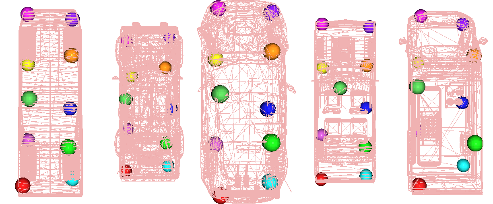 | 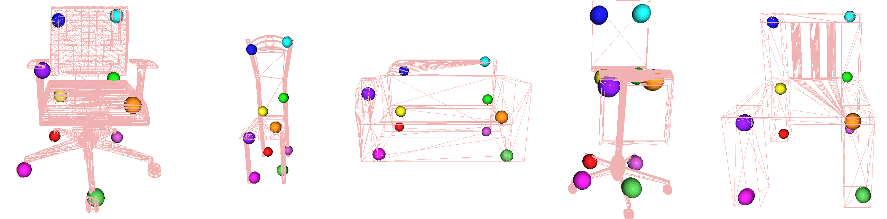 |
|:----------------:|:------------------:|
|  | 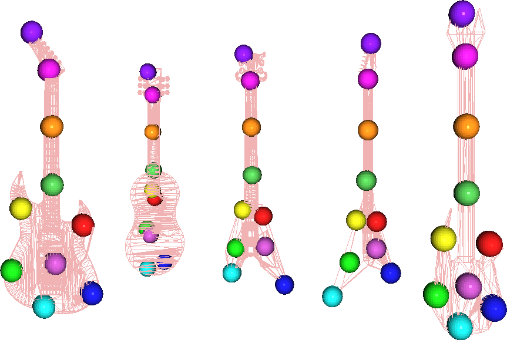 |
