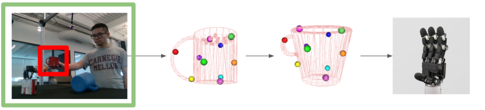
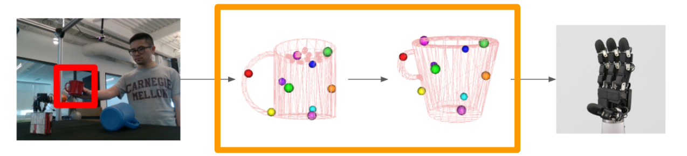

# Pipeline overview (A)

<!-- Only one element on this page should use the name `diagram` -->

dasdsadas

---

# Pipeline overview (B) — morphs on slide change

<!-- Same name `diagram`, different size/position/src is fine -->

dasdsadas